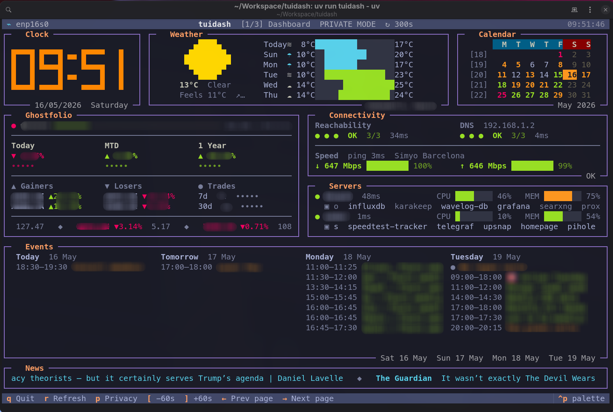
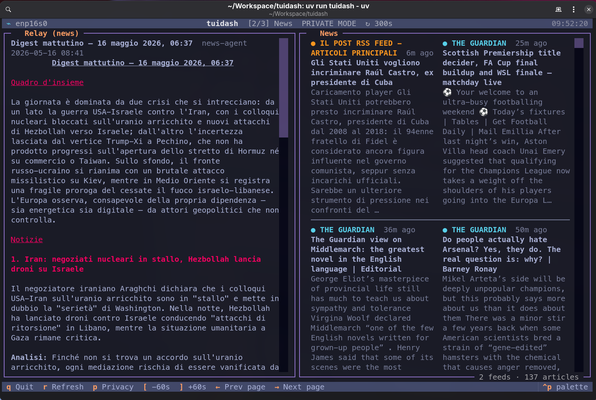
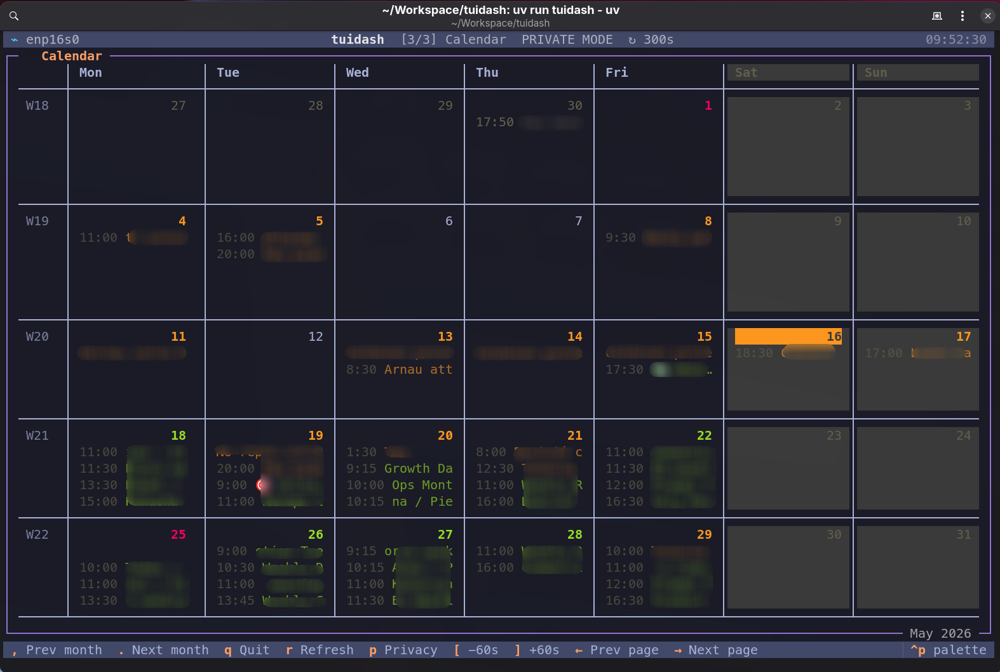

# tuidash

[](https://github.com/pierdom/tuidash/actions/workflows/docker.yml)

A personal terminal dashboard built with [Textual](https://textual.textualize.io/) and [Rich](https://rich.readthedocs.io/).

## Why this exists

This is a pure fun project. I wanted to explore building a terminal app — I like the retro aesthetic, and honestly, who needs a reason beyond that.

A few specific things I was after:

- **A kitchen display.** The long-term idea is to run this on an e-ink screen in the kitchen, MagicMirror-style but with a retro terminal look. That's a separate side project, but tuidash is the software side of it.
- **AI agent output, surfaced nicely.** The News page (second screenshot) shows a digest generated by AI agents and pushed via a self-hosted relay API. If that sounds interesting, check out the companion project: [pierdom/relay](https://github.com/pierdom/relay), which also includes an MCP server so agents can post to it directly.
- **Just vibes.** This was mostly vibecoded. No yolo mode, but still — don't expect polished abstractions.

It's wired to my own services and feeds, so it's not designed to be plug-and-play for anyone else. You're welcome to fork it and adapt it, but don't expect a general-purpose dashboard framework.







## What it shows

| Widget | Source |
|---|---|
| Clock | System time, pixel-art half-block font |
| Weather | [Open-Meteo](https://open-meteo.com/) — current conditions + 6-day forecast |
| Calendar | Month view with public-holiday, family, personal and work event highlighting via ICS feeds |
| Portfolio | [Ghostfolio](https://ghostfolio.app/) — net worth, daily/MTD/1Y performance, live ticker |
| Connectivity | Ping reachability, DNS resolution, download/upload speed via [Speedtest Tracker](https://github.com/alexjustesen/speedtest-tracker) |
| Servers | Per-host ping, CPU, RAM and Docker container health via [Glances](https://github.com/nicolargo/glances) |
| Events | 4-day calendar view (today + 3) from ICS feeds |
| News ticker | Full-width single-row continuous scroll of RSS headlines from the last 6 hours |
| News reader | Full-page RSS reader (page 2) with article thumbnails |

## Running

```bash
uv run tuidash                        # terminal
uv run tuidash --serve                # browser at http://localhost:8080
uv run tuidash --serve --port 9000    # custom port
```

## Requirements

- Python 3.13+
- [uv](https://docs.astral.sh/uv/)
- [mpv](https://mpv.io/) — optional, required only for podcast playback

Copy `.env.example` to `.env` and fill in the values that apply to you.

## Docker

```bash
docker pull ghcr.io/pierdom/tuidash:latest
cp .env.example .env   # fill in your values
docker compose up -d
```

The dashboard is served at `http://localhost:8080`. A named volume (`tuidash-data`) is created automatically to persist podcast playback positions across container restarts.

## Configuration

All settings are environment variables prefixed `TUIDASH_`. See `.env.example` for the full list with descriptions.

Key variables:

| Variable | Default | Description |
|---|---|---|
| `TUIDASH_THEME` | `textual-dark` | Any Textual built-in theme (e.g. `tokyo-night`, `nord`, `dracula`) |
| `TUIDASH_REFRESH` | `300` | Data refresh interval in seconds |
| `TUIDASH_PRIVACY_DEFAULT` | `false` | Start in privacy mode (monetary values hidden); toggle with `p` |
| `TUIDASH_PRIVACY_FORCE` | `false` | Force privacy mode; disables the `p` toggle entirely |
| `TUIDASH_WEATHER_LOCATION` | — | City name (`"Rome"`) or coordinates (`"41.9,12.5"`) |
| `TUIDASH_GHOSTFOLIO_URL` | — | Base URL of your Ghostfolio instance |
| `TUIDASH_GHOSTFOLIO_TOKEN` | — | Ghostfolio anonymous access token |
| `TUIDASH_GHOSTFOLIO_GOAL` | `1000000` | Portfolio goal for the progress bar |
| `TUIDASH_HOLIDAY_CALENDAR` | — | ICS URL for public holidays (e.g. officeholidays.com) |
| `TUIDASH_FAMILY_ICS` | — | ICS URL for family calendar events |
| `TUIDASH_FAMILY_COLOR` | `yellow` | Rich color name for family event days |
| `TUIDASH_PERSONAL_ICS` | — | ICS URL for personal calendar events |
| `TUIDASH_PERSONAL_COLOR` | `teal` | Rich color name for personal event days |
| `TUIDASH_WORK_ICS` | — | ICS URL for work calendar events |
| `TUIDASH_WORK_COLOR` | `green` | Rich color name for work event days |
| `TUIDASH_RSS_FEEDS` | — | Comma-separated RSS feed URLs |
| `TUIDASH_HOSTS` | — | Comma-separated Glances URLs |
| `TUIDASH_DNS_RESOLVER` | system | Custom DNS server IP for connectivity checks |
| `TUIDASH_SPEEDTESTTRACKER_URL` | — | Speedtest Tracker instance URL |
| `TUIDASH_SERVE_URL` | auto-detected | Public URL for `--serve` WebSocket (set this in Docker) |

## Keybindings

| Key | Action |
|---|---|
| `q` | Quit |
| `r` | Refresh all widgets on the current page |
| `p` | Toggle privacy mode (masks monetary values) |
| `[` / `]` | Decrease / increase refresh interval by 60 s |
| `←` / `→` | Navigate between pages (wraps) |

## Serve mode

`tuidash --serve` starts a web server so the dashboard can be viewed in a browser or on a tablet. The public URL (used for the WebSocket connection) is auto-detected in this order: `TUIDASH_SERVE_URL` env var → Tailscale IP → LAN IP (`192.168.x.x`) → private IP (`10.x.x.x`) → `localhost`. Set `TUIDASH_SERVE_URL` explicitly when running inside Docker or when auto-detection picks the wrong interface.

> **Security note:** `--serve` has no built-in authentication. The dashboard exposes personal data (finances, calendar, network topology). Do not expose the port directly to the internet — place it behind an authenticated reverse proxy (nginx, Caddy, Tailscale Serve) or restrict access at the firewall level.
